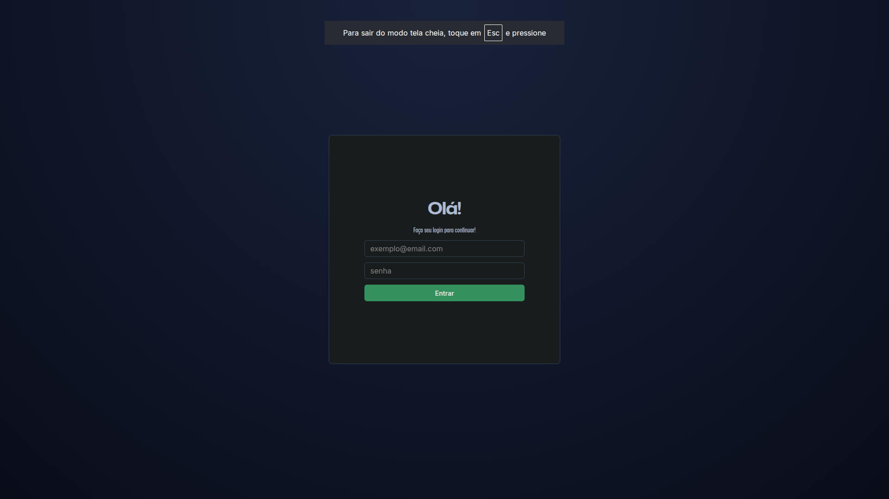
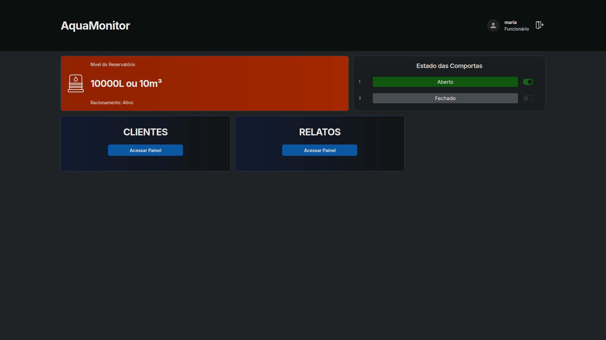
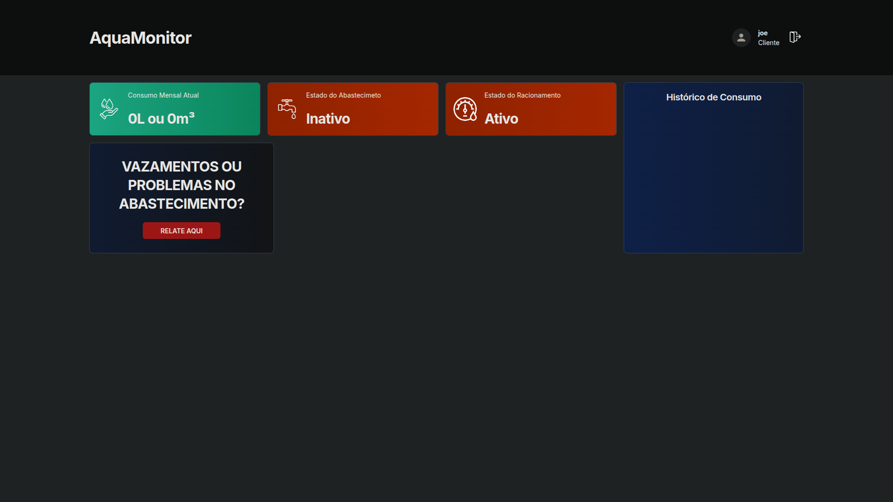
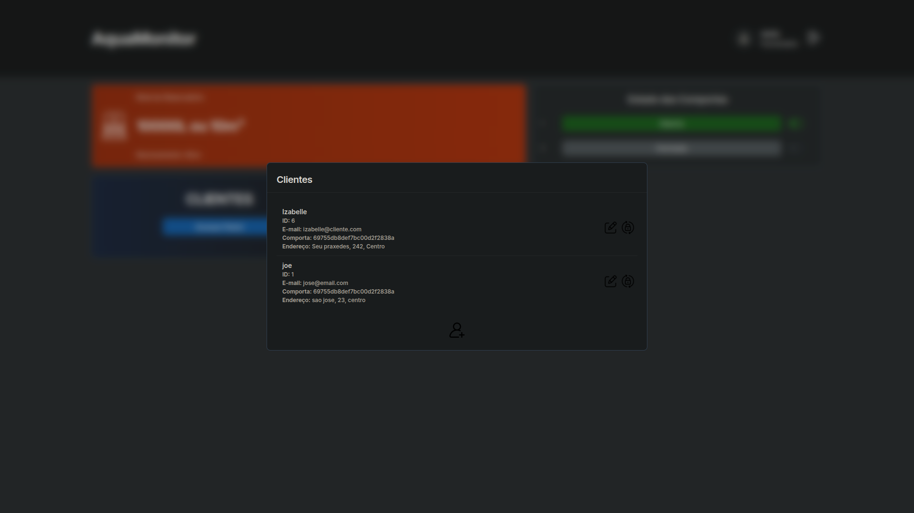
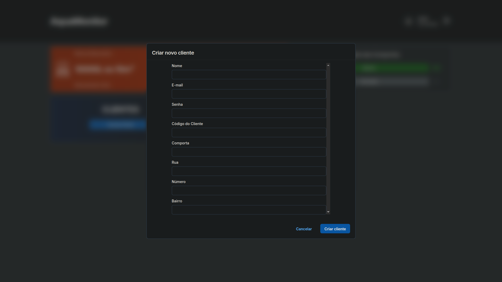
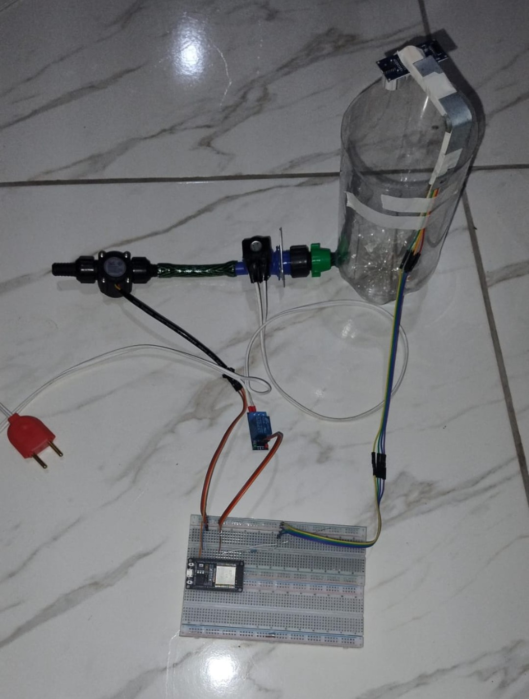

# Sistema de Monitoramento e Gestão Hídrica

[](https://nodejs.org/)
[](https://react.dev/)
[](https://www.mongodb.com/)
[](https://mqtt.org/)
[](https://jwt.io/)

Sistema de monitoramento e gestão hídrica desenvolvido para facilitar o acompanhamento do abastecimento, o controle operacional e a comunicação entre usuários, infraestrutura e dispositivos embarcados. O projeto foi pensado para demonstrar uma solução completa em IoT e desenvolvimento full stack, integrando backend, frontend, banco de dados e comunicação em tempo real via MQTT.

O objetivo principal é unir tecnologia embarcada e web em uma aplicação funcional, com foco em usabilidade, automação e gestão remota de recursos hídricos.

---

## 📌 Sobre o Projeto

Este projeto foi desenvolvido como uma solução para monitorar e controlar o abastecimento de água em uma unidade, permitindo que:

- clientes acompanhem o consumo, o status do abastecimento e o racionamento;
- funcionários visualizem o nível do reservatório, o estado das comportas e os relatos dos clientes;
- o sistema embarcado envie dados em tempo real para o backend através do protocolo MQTT;
- operações de controle e manutenção sejam executadas de forma centralizada e segura.

A aplicação combina arquitetura web, autenticação, integração com banco de dados e comunicação com hardware, representando um projeto completo e bastante interessante para portfólio.

---

## 🌟 Diferenciais

- Integração entre hardware e software;
- Comunicação MQTT em tempo real;
- Múltiplos perfis de usuário;
- API REST documentada com Swagger;
- Autenticação e autorização com JWT;
- Persistência de dados com MongoDB;
- Controle remoto de dispositivos;
- Arquitetura full stack.

---

## ✨ Funcionalidades

### Para clientes

- consulta do status da unidade;
- acompanhamento do consumo atual;
- visualização do cronograma de abastecimento;
- verificação de racionamento;
- envio de relatos sobre problemas no fornecimento;
- atualização de senha;
- consulta da situação das comportas vinculadas ao cliente.

### Para funcionários

- cadastro e gestão de clientes e funcionários;
- consulta do histórico de consumo;
- monitoramento do nível do reservatório;
- consulta do estado das comportas;
- acionamento remoto das comportas;
- listagem de relatos registrados pelos clientes;
- consulta de clientes específicos;
- reset de senha e manutenção de dados do sistema.

---

## 📷 Demonstração

As imagens abaixo mostram os principais fluxos do sistema e ajudam a ilustrar o projeto de forma mais clara para quem está acessando o repositório.

### Tela de login

<p align="center">
  
</p>

### Dashboard do funcionário

<p align="center">
  
</p>

### Dashboard do cliente

<p align="center">
  
</p>

### Gerenciamento de clientes

<p align="center">
  
</p>

### Cadastro de novo cliente

<p align="center">
  
</p>

> As demais capturas também estão disponíveis na pasta `docs/screenshots` do repositório.

---

## 🏗️ Arquitetura do Sistema

O projeto segue uma arquitetura modular com separação clara de responsabilidades.

```text
+-------------------+      +---------------+      +-------------------+
| Sistema Embarcado |<---->|  Broker MQTT  |<---->| Backend (Node.js) |
| (ESP32, sensores) |      |               |      | Express + MongoDB |
+-------------------+      +---------------+      +-------------------+
                                                            ^
                                                            |
                                                            v
                                                  +-------------------+
                                                  | Frontend (React)  |
                                                  |   Interface web   |
                                                  +-------------------+
```

### Camadas do sistema

1. Sistema embarcado
   - coleta dados de sensores;
   - envia informações para o broker MQTT;
   - recebe comandos de controle e operação.

2. Broker MQTT
   - atua como intermediário entre hardware e backend;
   - possibilita comunicação leve e assíncrona em tempo real.

3. Backend
   - API REST construída com Node.js e Express;
   - autenticação com JWT;
   - validação de entradas com Zod;
   - integração com MongoDB via Mongoose;
   - documentação gerada com Swagger.

4. Frontend
   - interface web em React;
   - acesso por clientes e funcionários;
   - consumo da API do backend para operações de leitura e escrita.

5. Banco de Dados
   - armazenamento dos usuários, consumos, relatos, níveis e configurações do sistema.

---

## 🧩 Tecnologias Utilizadas

### Backend

- Node.js
- Express
- MongoDB + Mongoose
- MQTT.js
- JWT
- Zod
- Swagger UI

### Frontend

- React
- Vite
- React Router
- MUI Joy
- JavaScript ES6+

### Infraestrutura e integração

- MQTT para comunicação em tempo real
- CORS para integração entre frontend e backend
- variáveis de ambiente para configuração segura

---

## 📁 Estrutura do Projeto

```text
sistema-hidrico/
├── backend/
│   ├── controllers/
│   ├── database/
│   ├── dtos/
│   ├── middlewares/
│   ├── models/
│   ├── mqtt/
│   ├── routers/
│   ├── .env.example
│   ├── index.js
│   └── package.json
├── frontend/
│   ├── src/
│   ├── public/
│   ├── index.html
│   ├── package.json
│   └── vite.config.js
├── firmware-esp32/
│   ├── main/
│   ├── CMakeLists.txt
│   └── Kconfig.projbuild
└── README.md
```

---

## 🔄 Como o Sistema Funciona

O fluxo principal do projeto pode ser entendido em etapas:

1. O sistema embarcado coleta dados de nível e consumo.
2. Esses dados são enviados por MQTT para o backend.
3. O backend valida, persiste e expõe as informações por meio da API.
4. O frontend consulta os dados e apresenta o painel para usuários.
5. Funcionários podem enviar comandos para controlar as comportas.
6. Clientes podem consultar o estado de abastecimento e registrar ocorrências.

Esse tipo de arquitetura mostra boa capacidade de integração entre hardware, software e dados em tempo real, além de ser uma excelente demonstração prática de desenvolvimento orientado a sistemas distribuídos.

---

## ⚙️ Pré-requisitos

Antes de executar o projeto, certifique-se de ter instalado:

- Node.js 18+
- npm
- Git
- MongoDB(local ou Atlas)
- Broker MQTT acessível

---

## 🚀 Como Executar o Projeto

### 1. Clone o repositório

```bash
git clone https://github.com/jalmirsiqueira3/sistema-hidrico.git
cd sistema-hidrico
```

### 2. Configure o backend

Entre na pasta do backend e instale as dependências:

```bash
cd backend
npm install
```

Crie um arquivo `.env` com base no exemplo disponível em `.env.exemple`:

```env
PORT=3000
MQTT_URL=mqtt://localhost
MQTT_TOPIC_NIVEL=sgh/reservatorio/nivel
MQTT_TOPIC_CLIENTE_CONSUMO=sgh/cliente/consumo
MQTT_TOPIC_COMPORTA_STATUS=sgh/reservatorio/comporta/status
MQTT_TOPIC_COMPORTA_ACIONAR=sgh/reservatorio/acionar
MQTT_TOPIC_ERROR_LOG=sgh/error/log
MONGODB_URL=mongodb://localhost:27017/sistema_hidrico
JWT_SECRET=sua_chave_super_secreta
JWT_EXPIRES_IN=300
```

> Se você estiver usando um broker MQTT ou MongoDB remoto, ajuste as variáveis de ambiente conforme necessário.

### 3. Inicie o backend

```bash
npm run dev
```

ou, em ambiente local com produção simulada:

```bash
npm run local
```

### 4. Configure o frontend

Em outro terminal:

```bash
cd frontend
npm install
npm run dev
```

### 5. Acesse a aplicação

- Frontend: http://localhost:5173
- Backend/API: http://localhost:3000
- Swagger Docs: http://localhost:3000/api-docs

---

## 🔌 Endpoints Principais

A API expõe rotas para autenticação, gestão de clientes, funcionários e monitoramento.

### Autenticação

- `POST /auth/login`
- `POST /auth/logout`

### Cliente

- `POST /cliente/criar/relato`
- `GET /cliente/consultar/consumo`
- `GET /cliente/listar/consumos`
- `GET /cliente/consultar/comporta/:id`
- `GET /cliente/consultar/racionamento`
- `PUT /cliente/atualizar/senha`

### Funcionário

- `POST /funcionario/criar/funcionario`
- `POST /funcionario/criar/cliente`
- `GET /funcionario/listar/clientes`
- `GET /funcionario/listar/funcionarios`
- `GET /funcionario/consultar/cliente/:id`
- `GET /funcionario/listar/comportas`
- `GET /funcionario/consultar/nivel`
- `POST /funcionario/acionar/comporta`
- `GET /funcionario/listar/relatos`

A documentação interativa da API pode ser acessada em `/api-docs`.

---

## 🛠️ Protótipo de Hardware

Para a implementação funcional do protótipo, esses foram os componentes utilizados:

| Categoria | Item | Especificação | Função |
|---|---|---|---|
| Microcontrolador | ESP32 | ESP32 DevKit ou similar | Controle do sistema embarcado |
| Reservatório | Recipiente plástico | Garrafa PET, balde ou similar | Armazenamento da água |
| Tubulação | Mangueiras e conexões | Silicone ou PVC | Transporte da água |
| Saídas de água | Mini Bomba de Água | Mini Bomba de Água 5V da marca PULACO| Controle de fluxo |
| Medição de fluxo | Sensores de fluxo (2x) | YF-S201 | Medição de volume |
| Medição de nível | Sensor ultrassônico | HC-SR04 / JSN-SR04T | Monitoramento do nível |
| Alimentação | Fonte de alimentação | 5V e 12V DC | Energia do sistema |
| Acionamento | Botões | Botões para acionar as "comportas" | Isolamento e acionamento |

### Registro do protótipo

<p align="center">
  
</p>

> **Observação:** esta imagem registra o protótipo físico desenvolvido e utilizado durante a apresentação inicial do projeto. A montagem serviu para demonstrar a integração entre o ESP32, sensores, bomba e circuito de acionamento, mas não representa a versão final do sistema, pois houveram alterações.

---

## 👨‍💻 Autores

### Joelmir Siqueira
- [GitHub](https://github.com/joelmirsiqueira)
- [LinkedIn](https://www.linkedin.com/in/joelmir-silva-de-siqueira-815a81332)

### Jalmir Siqueira
- [GitHub](https://github.com/jalmirsiqueira3)
- [LinkedIn](https://www.linkedin.com/in/jalmir-siqueira-a3221828a)

### Daniel Ferreira
- [GitHub](https://github.com/ThePocketRocket)
